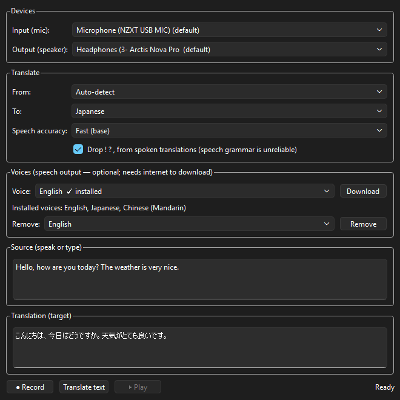

# llm-translator

Speak or type in one language and get it back as text and speech in another, fully offline on your
own PC. No API keys, no cloud, no subscription.

Built from Whisper (speech to text), NLLB-200 (translation), and Piper / VOICEVOX (text to speech).
Supports around 45 languages.



## Getting started (Windows)

### Option 1 — download and run (nothing to install)

1. Open the [Releases page](https://github.com/nullsection/llm-translator/releases/latest) and
   download a bundle:
   - `translator-offline-1.3B.zip` — recommended (about 1.9 GB).
   - The 3.3B bundle (best quality) is split into parts. Download the parts and
     `reassemble-3.3B.bat`, then double-click the script to rejoin them. See
     [dist/README.md](dist/README.md).
2. Unzip it anywhere.
3. Double-click `run-gui.bat`. The first launch sets itself up (about a minute), then the app opens.

It runs fully offline from that point on.

### Option 2 — build from source (smaller download)

```powershell
git clone https://github.com/nullsection/llm-translator
cd llm-translator
setup.bat          # installs dependencies and the 1.3B model
run-gui.bat        # launch
```

Choose a different model with `setup.bat 600M` (fastest) or `setup.bat 3.3B` (best quality).
On Linux (or macOS), run `./setup.sh` then `uv run translator gui` — see Platform support below.

## Using the app

1. Select your microphone and speaker, and choose the From and To languages.
2. Translate in one of two ways:
   - Speak: click Record, talk, then click Stop.
   - Type: enter text in the top box and click Translate text.
3. The translation appears on screen and is spoken aloud when a voice for that language is
   installed.

English, Chinese, and Japanese voices are included. For any other language, open the Voices panel
and click Download to enable speech. Languages without an installed voice show translated text only.

When the target language offers more than one voice, the **Voice** dropdown lets you pick between
them — English, for example, offers a male and a female voice. The extra voice downloads the first
time you use it.

## Supported languages

Every language below can be translated as text, fully offline. Speech output requires a voice:
English, Chinese, and Japanese voices are included; every other language's voice can be downloaded
from the Voices panel.

| Language | Code | Text translation | Voice (speech) |
|----------|------|------------------|----------------|
| English | en | Yes | Included |
| Japanese | ja | Yes | Included |
| Chinese (Mandarin) | zh | Yes | Included |
| Albanian | sq | Yes | Downloadable |
| Arabic | ar | Yes | Downloadable |
| Bengali | bn | Yes | Downloadable |
| Bulgarian | bg | Yes | Downloadable |
| Catalan | ca | Yes | Downloadable |
| Czech | cs | Yes | Downloadable |
| Danish | da | Yes | Downloadable |
| Dutch | nl | Yes | Downloadable |
| Finnish | fi | Yes | Downloadable |
| French | fr | Yes | Downloadable |
| Georgian | ka | Yes | Downloadable |
| German | de | Yes | Downloadable |
| Greek | el | Yes | Downloadable |
| Hindi | hi | Yes | Downloadable |
| Hungarian | hu | Yes | Downloadable |
| Icelandic | is | Yes | Downloadable |
| Indonesian | id | Yes | Downloadable |
| Italian | it | Yes | Downloadable |
| Kazakh | kk | Yes | Downloadable |
| Kurdish | ku | Yes | Downloadable |
| Latvian | lv | Yes | Downloadable |
| Luxembourgish | lb | Yes | Downloadable |
| Malayalam | ml | Yes | Downloadable |
| Nepali | ne | Yes | Downloadable |
| Norwegian | no | Yes | Downloadable |
| Persian | fa | Yes | Downloadable |
| Polish | pl | Yes | Downloadable |
| Portuguese | pt | Yes | Downloadable |
| Romanian | ro | Yes | Downloadable |
| Russian | ru | Yes | Downloadable |
| Serbian | sr | Yes | Downloadable |
| Slovak | sk | Yes | Downloadable |
| Slovenian | sl | Yes | Downloadable |
| Spanish | es | Yes | Downloadable |
| Swahili | sw | Yes | Downloadable |
| Swedish | sv | Yes | Downloadable |
| Telugu | te | Yes | Downloadable |
| Turkish | tr | Yes | Downloadable |
| Ukrainian | uk | Yes | Downloadable |
| Urdu | ur | Yes | Downloadable |
| Vietnamese | vi | Yes | Downloadable |
| Welsh | cy | Yes | Downloadable |

## Choosing a model

All three models translate roughly 45 languages offline. A larger model is somewhat more fluent but
slower and larger on disk. Speeds below are for a short sentence on a desktop CPU.

| Model | Size    | Speed    | Quality                                           |
|-------|---------|----------|---------------------------------------------------|
| 600M  | ~0.6 GB | ~0.12 s  | good                                              |
| 1.3B  | ~1.4 GB | ~0.20 s  | very good; matches Google when translating into English |
| 3.3B  | ~3.2 GB | ~0.42 s  | best                                              |

To switch models later, delete the `models/nllb` folder and run `setup.bat <size>` again, or
download the matching bundle. A GPU is used automatically when the CUDA runtime is installed;
otherwise the app runs on CPU.

### Side-by-side output

The same sentences through each model. For everyday input the results are nearly identical; the
larger models mainly help on harder, idiomatic phrasing (for example, only 3.3B renders "raining
cats and dogs" as heavy rain rather than translating it literally).

| Input | 600M | 1.3B | 3.3B |
|-------|------|------|------|
| EN to JA: "Where is the nearest subway station?" | 最寄りの地下鉄駅はどこですか | same | same |
| EN to ZH: "...rescheduled to next Monday at 10 a.m." | 会议被重新安排到下周一上午10点 | 会议已重新安排为下周一早上10点 | 会议已重新安排到下周一上午10点 |
| EN to JA (idiom): "It's raining cats and dogs." | 外は猫と犬の雨だ | 外は猫と犬の雨が降っている | 外は大雨が降っている |
| JA to EN (polite): "...恐縮ですが、ご確認いただけますでしょうか。" | I'm afraid you're too busy, but can you check? | I'm afraid you're a little busy, but can you confirm that? | I'm afraid you're busy, but could you check? |
| ZH to EN: "麻烦你把窗户关一下，谢谢。" | Please close the window, thank you | same | same |

## Command line

```powershell
translator gui                                    # desktop app
translator text "Where is the station?" --to ja   # translate typed text
translator translate clip.wav --to zh --out zh.wav # translate an audio file
translator voices                                  # list and manage voices
translator get-voice fr                            # download a voice
translator doctor                                  # environment health check
```

Prefix commands with `uv run` if you built from source rather than downloading a bundle.

## Platform support

- **Windows 10/11** — fully supported, including the one-click offline bundles and Japanese speech.
- **Linux** — verified on Ubuntu (installs via `setup.sh`): speech recognition, translation, and
  Piper voices (English, Chinese, and the downloadable languages) all work. Japanese *speech* uses
  VOICEVOX, which is currently wired up for Windows only, so on Linux Japanese is **text-only** (it
  still transcribes and translates). The live microphone and the desktop window additionally need
  system audio (`libportaudio2`) and a graphical display.
- **macOS** — uses the same cross-platform components and should behave like Linux, but this has
  **not been tested**. Consider it experimental.

## Licenses

The source code is MIT licensed. The models it downloads carry their own terms. Most are
permissive; two are worth noting:

- NLLB-200 (translation) is CC-BY-NC, meaning non-commercial use only. For commercial use, set
  `TRANSLATOR_MT=argos` to switch to the unrestricted Argos engine (lower quality).
- VOICEVOX (Japanese voice) requests a credit line if you publish its audio.

See [NOTICE.md](NOTICE.md) for full details.

## Troubleshooting

- Run `translator doctor` to check the model, voices, audio devices, and run a self-test.
- See `logs/translator.log` for details of any error.
